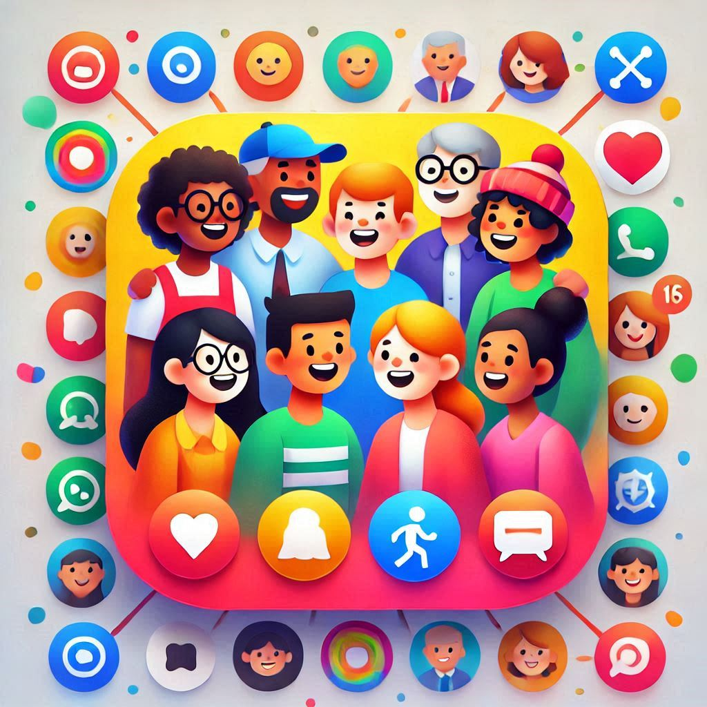

# People

Wonderful app to keep your people's information in one place, easily accessible and searchable and organized.



People will help you maintain your contacts, keep track of your relationships, and stay in touch with the people who matter to you.

## Features

- Add notes to contacts
- Set follow-up reminders
- Attach photos to contacts
- Add events related to contacts
- Local storage of all data (IndexedDB)
- Export and import data to move across browsers/devices
- Links to various social media accounts

## How to Use

1. **Add Contact**: Fill in the contact form with the name, email, phone, notes, follow-up date, photo, and events. Click the "Add Contact" button to save the contact.
2. **Edit Contact**: Click the "Edit" button next to a contact in the contact list. Update the contact information in the form and click the "Save" button.
3. **Delete Contact**: Click the "Delete" button next to a contact in the contact list to remove the contact.
4. **Export Data**: Click the "Export" button to download a file containing all your contacts.
5. **Import Data**: Click the "Import" button and select a file to upload your contacts from a previous export.

## Technical Details

The 'People' app is built using Angular and stores data locally using IndexedDB. The app's UI is designed with modern design principles and includes smooth animations. The app also supports exporting and importing data to allow users to move their contacts across different browsers and devices.

### IndexedDB

IndexedDB is used to store all contact data locally in the user's browser. This ensures that the data is available even when the user is offline. The app provides methods to add, edit, and delete contacts, as well as to export and import data.

### Routes

The app defines routes for managing contacts and adding related information. The following routes are available:

- `/`: Displays the contact list
- `/add`: Displays the form to add a new contact
- `/edit/:id`: Displays the form to edit an existing contact

### Components

The app consists of the following components:

- `ContactListComponent`: Displays the list of contacts
- `AddContactComponent`: Displays the form to add a new contact
- `EditContactComponent`: Displays the form to edit an existing contact

### Methods

The app includes methods to handle form submissions, update the contact list, and manage notes, follow-up, photos, events, and other contact-related data.

## Installation

To install and run the 'People' app locally, follow these steps:

1. Clone the repository: `git clone https://github.com/sondreb/people.git`
2. Navigate to the project directory: `cd people`
3. Install dependencies: `npm install`
4. Start the development server: `npm start`
5. Open your browser and navigate to `http://localhost:4200`

## Deployment

To deploy the 'People' app to GitHub Pages, run the following command:

```
npm run deploy
```

This will build the app and deploy it to the `gh-pages` branch of the repository.

## License

This project is licensed under the MIT License. See the [LICENSE](LICENSE) file for details.
